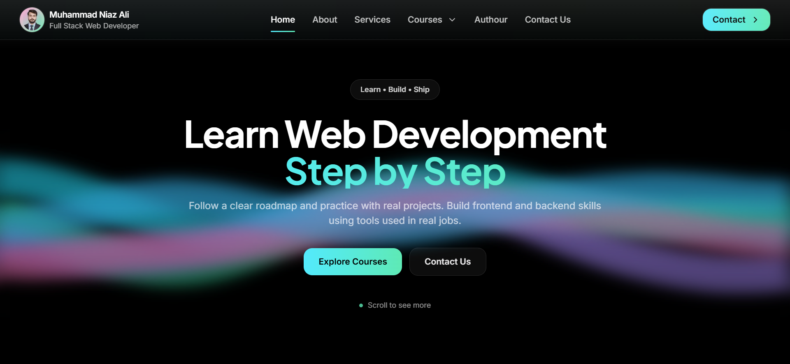
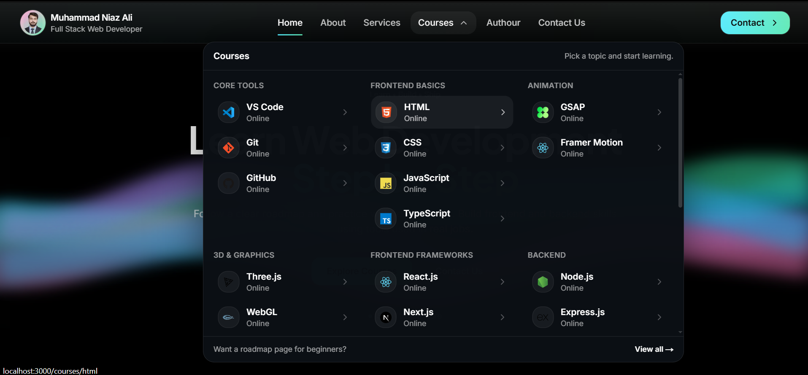
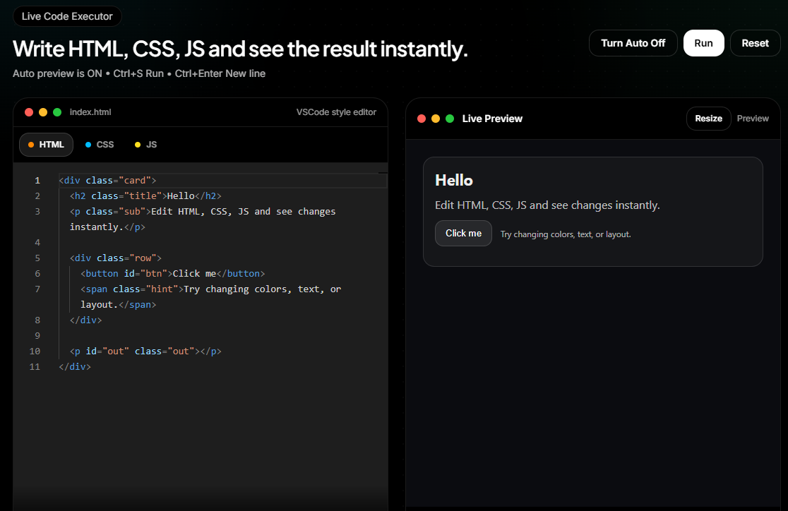

# WebDev Learning Hub

A single website + repo where I practice web development and document what I learn.  
It includes notes, examples, and mini builds for frontend and backend topics.

## Screenshots





## Why this project exists

I wanted one place to learn and also ship real UI pages.  
This repo helps me revise faster and build a portfolio at the same time.

## What you will find here

- Topic-wise documentation and short notes.
- Copy-paste ready examples with explanations.
- Mini projects per topic, with goals and checklists.
- Clean UI screens that grow step by step.

## Tech I cover in this repo

### Frontend
- HTML, CSS
- JavaScript, TypeScript
- Vue.js, Nuxt.js

### Backend
- Node.js
- Express.js
- NestJS
- MongoDB

## Project structure (recommended)

You can organize docs like this:

- `app/` → Next.js pages and UI
- `public/view/` → screenshots
- `docs/`
  - `docs/frontend/` → HTML, CSS, JS, TS, Vue, Nuxt notes
  - `docs/backend/` → Node, Express, Nest notes
  - `docs/database/` → MongoDB notes
- `examples/` → small runnable examples
- `mini-projects/` → small builds with a README per build

## Local setup

### Requirements
- Node.js 18+ (recommended)
- npm / pnpm / yarn (any one)

### Install
```bash
npm install
